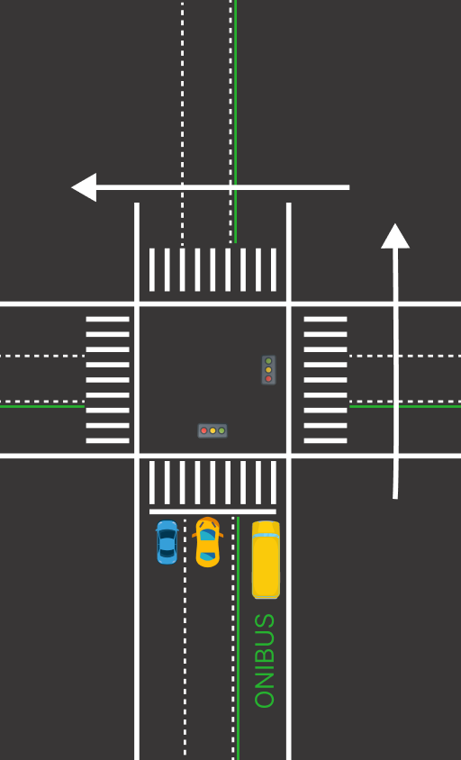
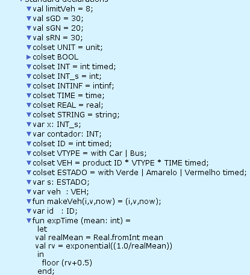
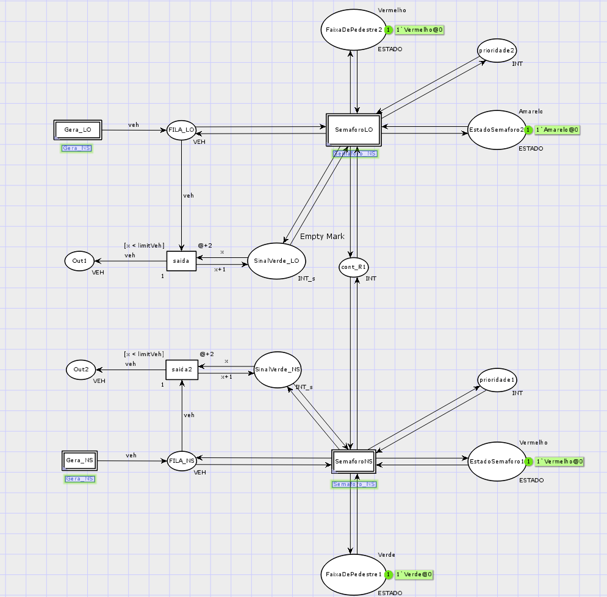
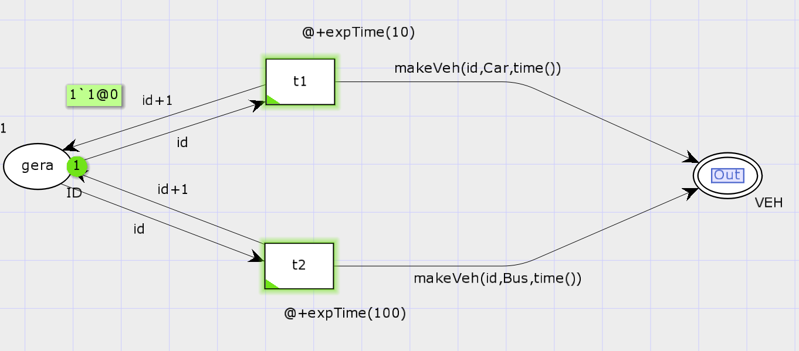
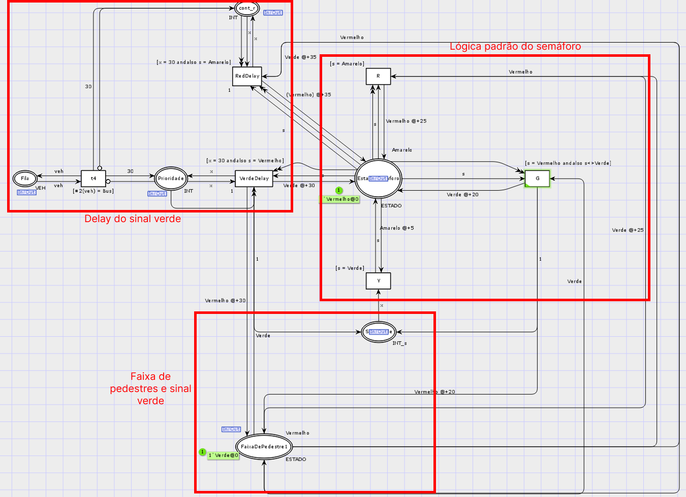
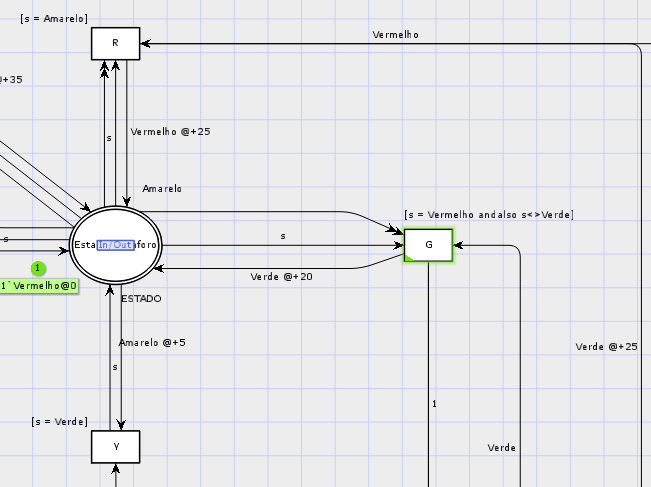
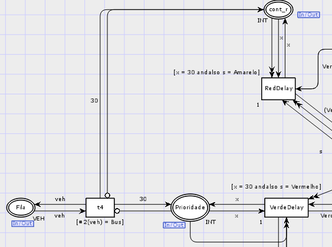
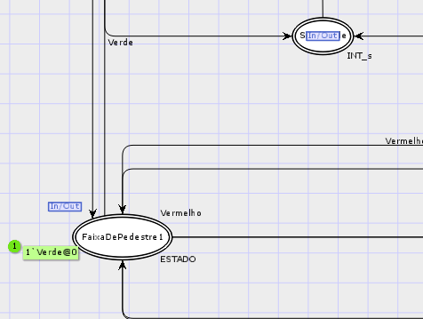
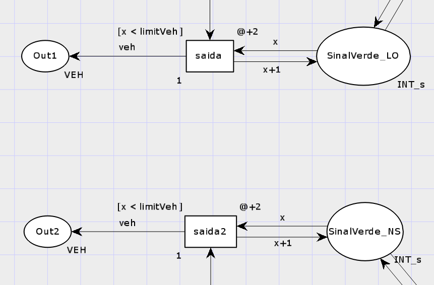

# Segundo projeto da disciplina Sistemas a Eventos Discretos

## Integrantes
- Marcus Vinícius de Medeiros - 121110400  
- Willian Santos Moreira - 121110532  
- Ygor de Almeida Pereira - 121110166  

---

## 1. Descrição do problema
O projeto consiste na **modelagem de um Sistema de Controle de Tráfego com Prioridade para Transporte Público**, utilizando **Redes de Petri Coloridas Hierárquicas (HCPN)**.  

O objetivo principal é desenvolver um modelo capaz de simular e analisar o funcionamento de uma interseção urbana, explorando recursos de hierarquia, cores e temporização, característicos de sistemas a eventos discretos. Mais especificamente, o trabalho busca representar o comportamento de uma interseção com múltiplas faixas, considerando mecanismos de **prioridade para transporte público**, como ônibus.  

Para isso, a hierarquia é utilizada para modularizar o sistema em subsistemas, como:
- Controle de semáforos;  
- Detecção de veículos;  
- Gerenciamento de filas.  

O modelo permite analisar o tráfego de forma detalhada, facilitando a avaliação do desempenho e a verificação de propriedades formais, como ausência de deadlocks e limitação de tokens.

---

## 2. Esquemático do sistema

   
   
  <em>Figura 1 - Esquemático do modelo</em> 

---

## 3. Variáveis e conjunto de cores do sistema

  
   
  <em>Figura 2 - Variáveis e colsets do sistema</em>

Algumas variáveis são essenciais para o entendimento do projeto:  

- **val limitVeh = 8**  
  Define a quantidade máxima de veículos que podem passar pelo semáforo quando ele estiver verde.  

- **INT e INT_s**  
  Tipos inteiros com e sem acompanhamento de delay, respectivamente.  

- **VTYPE**  
  Define o tipo de veículo.  

- **VEH**  
  Conjunto que representa um produto de `(inteiro | tipo de veículo | tempo)`, permitindo monitorar a quantidade de veículos gerados, seu tipo e o instante em que foram gerados.  

- **Função makeVeh**  
  Cria uma instância do tipo `VEH`.  

- **Função expTime**  
  Gera veículos aleatoriamente, simulando chegadas de forma realista.  

---

## 4. Modelo no CPN Tools

A figura 3 apresenta uma visão geral da página principal do sistema, que é modularizado para facilitar a visualização e interpretação do modelo.  

  
   
  <em>Figura 3 - Visão geral do sistema</em>

### 4.1 Gera_NS e Gera_LO
A figura 4 ilustra a lógica de geração de veículos: a transição superior gera carros, enquanto a inferior gera ônibus.  

  
   
  <em>Figura 4 - Geração de veículos</em>

Ambos os tipos de veículos passam pela função `makeVeh` para obter as informações necessárias, que serão usadas na definição de prioridade. A lógica é aplicada nos dois semáforos (Norte-Sul e Leste-Oeste), de forma invertida entre eles.

---

### 4.2 Semáforos

A figura 5 mostra a lógica completa do semáforo, incluindo a sequência padrão de cores e a prioridade quando um ônibus está presente na fila.  

  
   
  <em>Figura 5 - Semáforo</em>

#### 4.2.1 Lógica padrão dos semáforos
A figura 6 demonstra a lógica padrão, em que a *place* `EstadoSemaforo` indica o estado atual do semáforo, iniciando no amarelo.  
Os tempos definidos são:
- Amarelo: 5 unidades de tempo;  
- Verde: 20 unidades;  
- Vermelho: 25 unidades.  

Quando há prioridade para ônibus, o verde é estendido para 30 unidades de tempo (figura 7).  

  
   
  <em>Figura 6 - Lógica padrão do semáforo</em>

#### 4.2.2 Delay do sinal verde com prioridade
A figura 7 mostra a ativação da prioridade: quando um ônibus chega, a transição `t4` com a *guard* `[ #2(veh) = Bus ]` reconhece o veículo e envia um token (`x = 30`) para a *place* `EstadoSemaforo`, prolongando o verde.  

  
   
  <em>Figura 7 - Lógica de prioridade</em>

#### 4.2.3 Faixa de pedestre
A figura 8 modela a faixa de pedestres, que funciona de forma invertida em relação aos semáforos de veículos, permitindo a passagem segura de pedestres quando o sinal está vermelho.  

  
   
  <em>Figura 8 - Faixa de pedestre</em>

---

### 4.3 Saída de veículos
A figura 9 representa a saída de veículos, separando Norte-Sul e Leste-Oeste.  
A transição `saida` possui *guard* que limita a passagem a 8 veículos e aplica um *delay* de duas unidades de tempo, conforme descrito na seção 3.  

  
   
  <em>Figura 9 - Saída de veículos</em>

---

## 5. Considerações finais
O modelo desenvolvido permite simular e analisar de forma detalhada o fluxo de tráfego em uma interseção urbana, considerando a **prioridade para transporte público**.  
A modularização hierárquica e o uso de cores e temporizações tornam o sistema mais fácil de interpretar e de ajustar para diferentes cenários.  

Entre os principais pontos observados:
- A priorização de ônibus impacta positivamente no fluxo de transporte público sem comprometer totalmente o tráfego de veículos comuns;  
- A modelagem permite verificar propriedades formais, como ausência de deadlocks e limitação de tokens;  
- O modelo é facilmente extensível, podendo incluir mais faixas, sensores adicionais ou regras de prioridade específicas.  

Este projeto demonstra como **Redes de Petri Coloridas Hierárquicas** podem ser aplicadas em sistemas de controle de tráfego urbano, oferecendo uma ferramenta útil para análise, simulação e planejamento.
